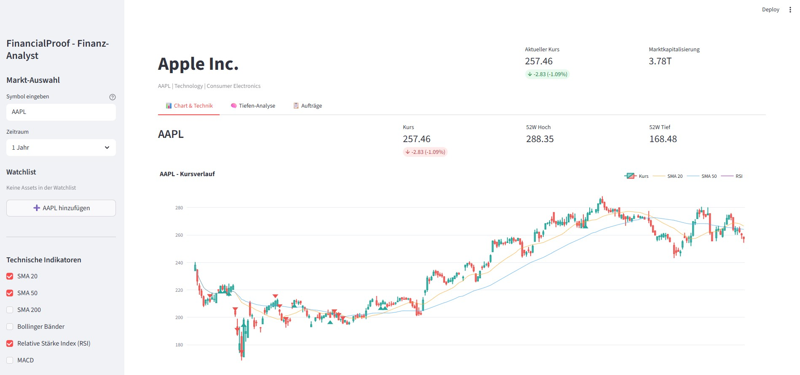
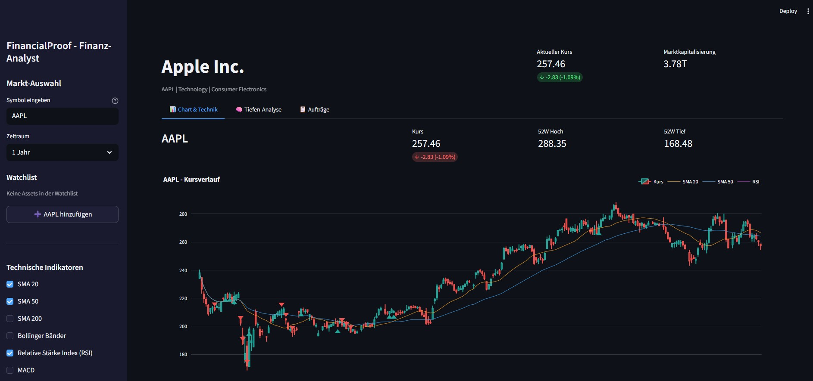

# FinancialProof

> ⚠️ **Keine Anlageberatung / No Financial Advice**
>
> FinancialProof ist ein **technisches Werkzeug** zur statistischen
> Mustererkennung auf Finanzdaten. Es ist:
>
> - **Keine Anlageberatung** (§ 32 KWG, § 2 Abs. 9 WpHG)
> - **Keine Kauf-/Verkaufsempfehlung**
> - **Keine Prognose** künftiger Kursentwicklungen
> - **Nicht BaFin-zugelassen**, nicht reguliert
>
> Die angezeigten Indikatoren sind historische statistische Muster.
> Anlageentscheidungen bleiben eigenverantwortlich — konsultieren Sie
> qualifizierte Fachleute (Bank, Steuerberater, Anlageberater).
>
> Unentgeltliche Open-Source-Schenkung. Haftung auf Vorsatz und grobe
> Fahrlässigkeit beschränkt (§ 521 BGB). Nutzung auf eigenes Risiko.

A browser-based tool for statistical pattern analysis on financial market data.

## Features

- **Technical Indicators**: SMA, EMA, RSI, Bollinger Bands, MACD, Stochastic, ATR
- **Indicator Calculation**: Rule-based detection of technical patterns (e.g. MA crossovers, RSI extremes) — historical, not predictive
- **Statistical & Pattern Analyses**:
  - ARIMA time series analysis (historical fit, no forecast claim)
  - Monte Carlo simulation (historical Value-at-Risk estimation)
  - Mean Reversion analysis
  - Random Forest trend classification (historical)
  - Neural Network pattern recognition (historical)
  - Sentiment analysis (news texts)
  - Web Research Agent
- **Job Queue System**: Asynchronous analysis tasks with SQLite persistence
- **Watchlist**: Portfolio overview with multiple assets
- **Operational Logging**: Rotating local log file for runtime diagnostics
- **API Rate Limiting**: Configurable token-bucket throttling for yfinance calls
- **German User Interface**

> **Note on terminology:** Earlier versions of this project used the term
> "buy/sell signals". This has been replaced by "technical indicators" and
> "statistical patterns" throughout the UI and documentation, to avoid any
> implication of investment advice (§ 32 KWG, § 2 Abs. 9 WpHG). The
> underlying mathematical logic is unchanged; only the naming and framing
> have been adjusted.

## Screenshots

**Light Theme:**



**Dark Theme:**



## Installation

### Prerequisites

- Python 3.10+
- pip

### Setup

1. **Clone repository**
   ```bash
   git clone https://github.com/assistassets-ai/FinancialProof.git
   cd FinancialProof
   ```

2. **Create virtual environment** (recommended)
   ```bash
   python -m venv venv

   # Windows
   venv\Scripts\activate

   # Linux/Mac
   source venv/bin/activate
   ```

3. **Install dependencies**
   ```bash
   pip install -r requirements.txt
   ```

4. **Configure local environment** (optional)
   ```bash
   cp env.example .env
   # Optional: adjust FINANCIALPROOF_LOG_LEVEL and FINANCIALPROOF_RL_YF_*
   ```

5. **Launch app**
   ```bash
   streamlit run app.py
   ```

6. **Open browser**
   ```
   http://localhost:8501
   ```

### Windows launcher EXE

Für lokale Desktop-Nutzung kann zusätzlich ein Windows-Launcher erzeugt werden:

```bat
build_exe.bat
```

Der Build erzeugt `FinancialProof.exe`. Diese EXE bündelt bewusst nur den
Launcher und startet die lokale Python-/Streamlit-Umgebung im Projektordner.
Vor dem Start prüft der Launcher, ob `app.py`, Python und Streamlit verfügbar
sind, und zeigt sonst eine lokale Fehlermeldung an. Build-Artefakte wie
`build/`, `dist/`, `*.spec` und `FinancialProof.exe` bleiben durch `.gitignore`
außerhalb der versionierten Quellen. Der Launcher enthält keine Projektdaten,
keine API-Keys und keine Python-Abhängigkeiten.

On first launch, you will be asked to acknowledge the legal disclaimer
(not-financial-advice acknowledgement). The app will not proceed until
all four checkboxes are confirmed.

## Development and Tests

Run the local test suite before submitting changes:

```bash
python -m pytest tests -q
```

Current repository status:

- 134 unit and regression tests cover analysis modules, job execution,
  logging, rate limiting, disclaimer persistence and Streamlit helper flows.
- OHLCV input validation reports missing columns cleanly before running
  missing-value checks, so incomplete market data fails with diagnostics
  instead of a `KeyError`.
- Analyzer failure paths return error results and write diagnostic log entries
  instead of failing silently.
- Local runtime files are excluded from Git: `.env`, local databases,
  `.secrets`, disclaimer acknowledgements, logs, caches, release artifacts and
  internal task/test-lock files.

## Project Structure

```
FinancialProof/
├── app.py                   # Main application
├── config.py                # Configuration
├── requirements.txt         # Dependencies
│
├── core/
│   ├── database.py          # SQLite database
│   ├── data_provider.py     # yfinance wrapper
│   ├── logging_utils.py     # Logging setup
│   └── rate_limiter.py      # Token-bucket API throttling
│
├── indicators/
│   ├── technical.py         # Technical indicators
│   └── signals.py           # Pattern detection (internal module name)
│
├── analysis/
│   ├── base.py              # Abstract base class
│   ├── registry.py          # Analysis registry
│   ├── statistical/         # ARIMA, Monte Carlo, Mean Reversion
│   ├── ml/                  # Random Forest, Neural Network
│   └── nlp/                 # Sentiment, Research Agent
│
├── jobs/
│   ├── manager.py           # Job management
│   └── executor.py          # Job execution
│
├── ui/
│   ├── sidebar.py           # Sidebar component
│   ├── chart_view.py        # Chart view
│   ├── analysis_view.py     # Analysis tab
│   ├── job_queue.py         # Job queue view
│   └── disclaimer_widget.py # First-start acknowledgement
│
└── data/
    └── financial.db         # Generated SQLite database (not committed)
```

## Usage

### Enter Symbol

Enter a ticker symbol in the sidebar:
- Stocks: `AAPL`, `MSFT`, `GOOGL`
- ETFs: `SPY`, `QQQ`, `VOO`
- Crypto: `BTC-USD`, `ETH-USD`
- Indices: `^GSPC`, `^DJI`

### Start Analysis

1. Select a time period (1M - 5Y)
2. Activate desired technical indicators
3. Switch to the "Statistical Analysis" tab
4. Select an analysis method and start the job

### View Results

- The "Jobs" tab shows all running and completed jobs
- Click on a job for details and the calculated indicators
- Results are **historical analyses**, not recommendations

## Configuration

### Local Configuration

The sample file [`env.example`](env.example) contains empty, non-secret
defaults only and is loaded through `python-dotenv` when copied to `.env`.
Do not commit `.env`, `data/.key`, `data/.secrets`,
`data/.disclaimer_acceptance.json`, logs, or local databases.

API keys for optional Twitter/X and YouTube integrations are entered through
the Streamlit sidebar and stored locally in `data/.secrets`.

| Variable | Description | Default |
|----------|-------------|---------|
| `FINANCIALPROOF_LOG_LEVEL` | Python logging level (`DEBUG`, `INFO`, `WARNING`, `ERROR`) | `INFO` |
| `FINANCIALPROOF_RL_YF_CAPACITY` | yfinance burst capacity for the token bucket | `30` |
| `FINANCIALPROOF_RL_YF_REFILL` | yfinance token refill rate per second | `1.0` |
| `FINANCIALPROOF_RL_YF_TIMEOUT` | Maximum wait time per throttled yfinance call in seconds | `30` |

### Settings in `config.py`

```python
DEFAULT_TICKER = "AAPL"            # Default symbol
CACHE_TTL_MARKET_DATA = 3600       # Cache duration (seconds)
API_RATE_LIMIT_YFINANCE_CAPACITY = 30.0
API_RATE_LIMIT_YFINANCE_REFILL = 1.0
API_RATE_LIMIT_YFINANCE_TIMEOUT = 30.0
```

## Analysis Modules

| Module | Category | Description |
|--------|----------|-------------|
| ARIMA | Statistics | Historical time series fit |
| Monte Carlo | Statistics | Historical VaR simulation |
| Mean Reversion | Statistics | Mean-reversion analysis |
| Random Forest | ML | Historical trend classification |
| Neural Network | ML | Historical pattern recognition |
| Sentiment | NLP | News sentiment analysis |
| Research Agent | NLP | Web research |

All modules produce **descriptive, historical statistics**. None of the
outputs are forecasts, predictions, or trading recommendations.

## Technology Stack

- **Frontend**: Streamlit
- **Charts**: Plotly
- **Data**: yfinance, pandas, numpy
- **ML**: scikit-learn, TensorFlow (optional)
- **NLP**: transformers, TextBlob
- **Database**: SQLite
- **Logging**: Python logging with rotating file handler
- **Rate limiting**: Built-in token-bucket limiter for external API calls

## Roadmap

See [ROADMAP.md](ROADMAP.md) for planned features.

**Note:** Any future trading-integration features (Alpaca, CCXT, automated
order routing) are considered **out of scope** for this repository until
the regulatory classification under KWG / WpHG / MiFID II has been
clarified. The current repository is a pure analysis tool.

## Contributing

Contributions are welcome! See [CONTRIBUTING.md](CONTRIBUTING.md) for details.

## License

GPL v3 - See [LICENSE](LICENSE)

## Disclaimer

**This tool is for informational and research purposes only and does not
constitute investment advice, financial advice, or trading recommendations.**

The displayed technical indicators and statistical patterns are
derived from historical market data. They are **not** recommendations
to buy or sell securities, and they are **not** forecasts of future
price movements. Past performance does not indicate future results.

Consult a licensed financial advisor, bank, or tax advisor before making
investment decisions. The authors disclaim all liability for losses
incurred through use of this software, limited to intent and gross
negligence (§ 521 BGB).

FinancialProof is **not** authorized or regulated by BaFin or any other
financial supervisory authority. It is **not** a financial instrument
under § 2 WpHG and does **not** perform investment services under
§ 1 KWG.

## Changelog

See [CHANGELOG.md](CHANGELOG.md) for all changes.

---

## Deutsch

Ein browserbasiertes Werkzeug zur statistischen Mustererkennung auf
Finanzmarktdaten.

### Funktionen

- Technische Indikatoren (RSI, MACD, Bollinger, SMA, EMA, …)
- Indikator-Berechnung aus historischen Marktdaten (regelbasiert)
- Statistische und Machine-Learning-Analysen (historische Auswertung)
- Hintergrund-Job-Queue
- Interaktive Charts
- API-Rate-Limiting für externe Datenquellen

### Installation

```bash
git clone https://github.com/assistassets-ai/FinancialProof.git
cd FinancialProof
pip install -r requirements.txt
streamlit run app.py
```

Beim ersten Start erscheint ein Haftungs-Hinweis mit vier
Pflicht-Checkboxen, die bestätigt werden müssen, bevor die Anwendung
genutzt werden kann.

### Lizenz

Siehe [LICENSE](LICENSE) für Details.

> **Kein Rechts-/Steuer-/Anlage-Rat.** Dieses Projekt ist ein technisches
> Hilfswerkzeug zur historischen Musteranalyse, keine professionelle
> Beratung. Bei finanziellen, rechtlichen oder steuerlichen Entscheidungen
> konsultieren Sie qualifizierte Fachleute.
>
> **No legal/tax/investment advice.** This project is a technical tool
> for historical pattern analysis, not professional advice. Consult
> qualified professionals for financial, legal, or tax decisions.


---

## Haftung / Liability

Dieses Projekt ist eine **unentgeltliche Open-Source-Schenkung** im Sinne der §§ 516 ff. BGB. Die Haftung des Urhebers ist gemäß **§ 521 BGB** auf **Vorsatz und grobe Fahrlässigkeit** beschränkt. Ergänzend gelten die Haftungsausschlüsse aus GPL-3.0, wie in der [LICENSE](LICENSE) dokumentiert.

Nutzung auf eigenes Risiko. Keine Wartungszusage, keine Verfügbarkeitsgarantie, keine Gewähr für Fehlerfreiheit oder Eignung für einen bestimmten Zweck. Insbesondere keine Gewähr für die Eignung zu Anlage- oder Handelsentscheidungen.

This project is an unpaid open-source donation. Liability is limited to intent and gross negligence (§ 521 German Civil Code). Use at your own risk. No warranty, no maintenance guarantee, no fitness-for-purpose assumed — in particular, no fitness for investment or trading decisions.
