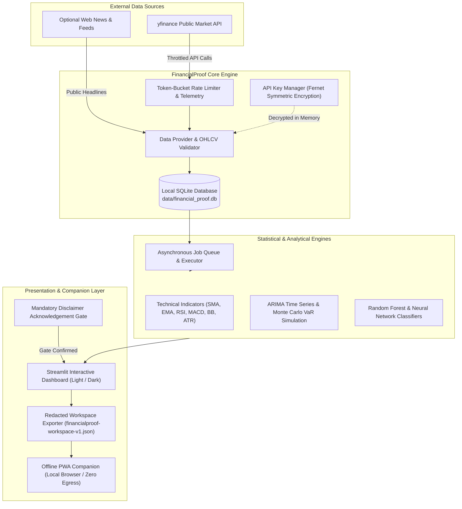
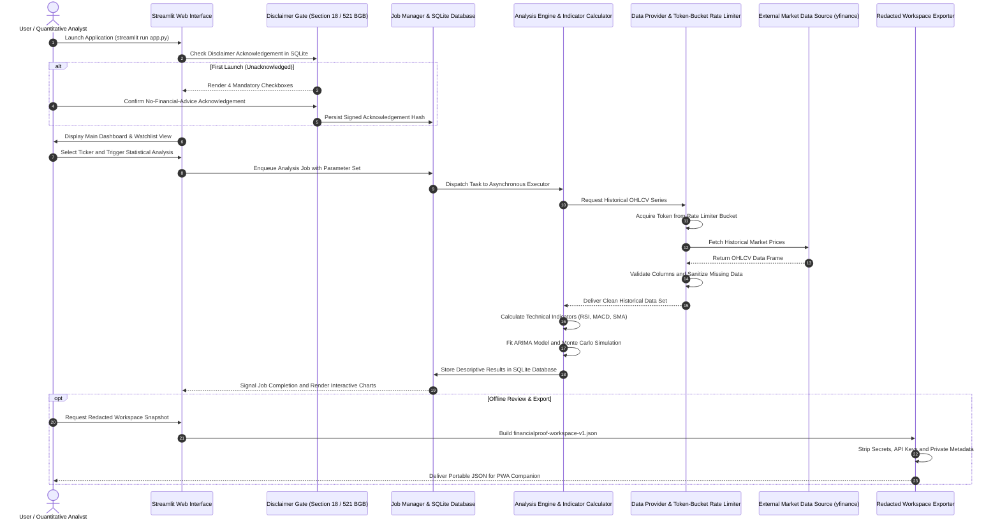

<!-- alternate banner: assets/banner-b.png (swap on occasion) -->

# FinancialProof

[](LICENSE)
[](https://python.org)
[](https://streamlit.io)
[](#15-testing-verification)
[](#12-offline-pwa-companion)
[](THIRD_PARTY_LICENSES.md)
[](MARKETING-LOG.txt)
[](SECURITY.md)
[](SECURITY.md)
[](#17-security-privacy)
[](#3-architecture)
[](llms.txt)
[](https://github.com/assistassets-ai)
[](https://github.com/open-bricks)
[](#18-legal-disclaimer)

🌐 **English** | [Deutsch](README_de.md)

> [!NOTE]
> **AI / LLM Integration & Machine-Readable Context**
> Automated AI agents, LLM assistants, and code analysis crawlers can read [`llms.txt`](llms.txt) for project structure, safety parameters, search terms, and test verification entry points.

> ⚠️ **Keine Anlageberatung / No Financial Advice**
>
> FinancialProof is a **technical software tool** for statistical pattern analysis and descriptive indicator evaluation on financial market data. It is:
> - **Not financial advice** (§ 32 KWG, § 2 Abs. 9 WpHG)
> - **Not a trading recommendation** or buy/sell signal service
> - **Not a predictive forecasting system**
> - **Not BaFin-regulated**, licensed, or registered
>
> All calculated indicators describe historical mathematical properties. Investment decisions remain strictly personal and self-directed. Unremunerated open-source gift; statutory liability limited to intent and gross negligence (§ 521 BGB).

---

## 🧭 Quick Navigation

[1. Overview](#1-overview) • [2. Features](#2-key-features) • [3. Architecture](#3-architecture) • [4. Lifecycle](#4-lifecycle) • [5. Personas](#5-target-personas) • [6. Comparison](#6-comparison-matrix) • [7. Invariants](#7-governance-invariants) • [8. Disambiguation](#8-search-disambiguation) • [9. Screenshots](#9-screenshots) • [10. Setup](#10-installation) • [11. Launcher](#11-windows-launcher) • [12. PWA](#12-offline-pwa-companion) • [13. Config](#13-configuration) • [14. Structure](#14-project-structure) • [15. Tests](#15-testing-verification) • [16. SBOM](#16-third-party-licenses) • [17. Security](#17-security-privacy) • [18. Disclaimer](#18-legal-disclaimer)

---

<a id="1-overview"></a><a id="overview"></a>
## 1. Overview

**FinancialProof** is an offline-first, local Streamlit application designed for historical financial market data analysis, mathematical indicator calculation, and statistical pattern recognition. Unlike commercial brokerage dashboards and automated trading bots, FinancialProof operates 100% on your local machine, persists state in an encrypted or local SQLite database, and isolates market research workflows from external tracking or cloud exposure.

Every result, chart, and metric is explicitly framed as a descriptive historical analysis rather than financial advice. FinancialProof empowers quantitative researchers, technical analysts, students, and privacy-conscious investors to examine historical asset behaviors, test statistical hypotheses, and review watchlists without transmitting sensitive watchlists or credentials to remote third-party SaaS vendors.

---

<a id="2-key-features"></a><a id="key-features"></a>
## 2. Key Features

- **Technical Indicator Suite**: Historical computation of SMA, EMA, RSI, Bollinger Bands, MACD, Stochastic Oscillators, and Average True Range (ATR).
- **Pattern & Anomaly Detection**: Rule-based detection of historical technical configurations (moving average crossovers, RSI overbought/oversold boundaries) — strictly descriptive, non-predictive.
- **Statistical Modeling & Simulation**:
  - **ARIMA Econometric Models**: Historical time series parameter estimation via `statsmodels` (diagnostic fit, no forecasting guarantees).
  - **Monte Carlo Simulations**: Historical Value-at-Risk (VaR) parameterization and distribution modeling.
  - **Mean Reversion Analysis**: Statistical deviation analysis, Z-score computation, and historical half-life calculations.
  - **Supervised ML Classification**: Historical trend categorization using Random Forest (`scikit-learn`) and neural network baselines (`tensorflow`).
  - **Financial News Sentiment**: Local NLP scoring of financial headlines via `transformers`.
  - **Web Research Agent**: Headless information retrieval for market news and corporate disclosures.
- **Asynchronous Job Queue**: Background execution of compute-heavy analyses backed by SQLite task persistence and status monitoring.
- **Configurable Strategy Presets**: Asset-class-specific parameter templates (Equities, Forex, Commodities, Crypto) with evaluation audit logs.
- **Multi-Asset Watchlist**: Local portfolio tracking, custom metadata tags, and quick-filter navigation.
- **Token-Bucket Rate Limiter**: Hardware-level request throttling and live telemetry for public market data APIs (`yfinance`).
- **Offline PWA Companion**: Independent zero-dependency browser companion (`web_companion/`) for reviewing exported watchlists on mobile devices with zero network access.

---

<a id="3-architecture"></a><a id="architecture"></a>
## 3. Architecture & System Topology

The architecture separates data acquisition, analytical processing, local storage, and presentation into decoupled layers operating entirely within user space:


```mermaid
flowchart TD
    subgraph External["External Data Sources"]
        YF["yfinance Public Market API"]
        Web["Optional Web News & Feeds"]
    end

    subgraph Core["FinancialProof Core Engine"]
        Throttler["Token-Bucket Rate Limiter & Telemetry"]
        DataProvider["Data Provider & OHLCV Validator"]
        DB[("Local SQLite Database<br/>data/financial_proof.db")]
        SecMgr["API Key Manager (Fernet Symmetric Encryption)"]
    end

    subgraph Analytics["Statistical & Analytical Engines"]
        IndCalc["Technical Indicators (SMA, EMA, RSI, MACD, BB, ATR)"]
        StatEng["ARIMA Time Series & Monte Carlo VaR Simulation"]
        MLEng["Random Forest & Neural Network Classifiers"]
        Queue["Asynchronous Job Queue & Executor"]
    end

    subgraph Presentation["Presentation & Companion Layer"]
        UI["Streamlit Interactive Dashboard (Light / Dark)"]
        Disclaimer["Mandatory Disclaimer Acknowledgement Gate"]
        Exporter["Redacted Workspace Exporter (financialproof-workspace-v1.json)"]
        PWA["Offline PWA Companion (Local Browser / Zero Egress)"]
    end

    YF -->|"Throttled API Calls"| Throttler
    Web -->|"Public Headlines"| DataProvider
    Throttler --> DataProvider
    DataProvider --> DB
    SecMgr -.->|"Decrypted in Memory"| DataProvider
    DB --> Queue
    Queue --> Analytics
    Analytics --> UI
    Disclaimer -->|"Gate Confirmed"| UI
    UI --> Exporter
    Exporter --> PWA
```

---

<a id="4-lifecycle"></a><a id="lifecycle"></a>
## 4. Execution Lifecycle & Data Flow


```mermaid
sequenceDiagram
    autonumber
    actor User as User / Quantitative Analyst
    participant UI as Streamlit Web Interface
    participant Gate as Disclaimer Gate (Section 18 / 521 BGB)
    participant Queue as Job Manager & SQLite Database
    participant Engine as Analysis Engine & Indicator Calculator
    participant Provider as Data Provider & Token-Bucket Rate Limiter
    participant Remote as External Market Data Source (yfinance)
    participant Export as Redacted Workspace Exporter

    User->>UI: Launch Application (streamlit run app.py)
    UI->>Gate: Check Disclaimer Acknowledgement in SQLite
    alt First Launch (Unacknowledged)
        Gate-->>UI: Render 4 Mandatory Checkboxes
        User->>Gate: Confirm No-Financial-Advice Acknowledgement
        Gate->>Queue: Persist Signed Acknowledgement Hash
    end
    UI->>User: Display Main Dashboard & Watchlist View

    User->>UI: Select Ticker and Trigger Statistical Analysis
    UI->>Queue: Enqueue Analysis Job with Parameter Set
    Queue->>Engine: Dispatch Task to Asynchronous Executor
    Engine->>Provider: Request Historical OHLCV Series
    Provider->>Provider: Acquire Token from Rate Limiter Bucket
    Provider->>Remote: Fetch Historical Market Prices
    Remote-->>Provider: Return OHLCV Data Frame
    Provider->>Provider: Validate Columns and Sanitize Missing Data
    Provider-->>Engine: Deliver Clean Historical Data Set

    Engine->>Engine: Calculate Technical Indicators (RSI, MACD, SMA)
    Engine->>Engine: Fit ARIMA Model and Monte Carlo Simulation
    Engine->>Queue: Store Descriptive Results in SQLite Database
    Queue-->>UI: Signal Job Completion and Render Interactive Charts

    opt Offline Review & Export
        User->>UI: Request Redacted Workspace Snapshot
        UI->>Export: Build financialproof-workspace-v1.json
        Export->>Export: Strip Secrets, API Keys and Private Metadata
        Export-->>User: Deliver Portable JSON for PWA Companion
    end
```

---

<a id="5-target-personas"></a><a id="target-personas"></a>
## 5. Target Personas & High-Intent SEO

FinancialProof is engineered for four primary user groups with specific technical requirements:

| Persona ID & Profile | Primary Use Case & Needs | High-Intent Search Queries | FinancialProof Solution |
|---|---|---|---|
| **`[PERSONA-01]` Quantitative Finance Students & Academic Researchers** | Empirical market analysis, algorithmic formula verification, ARIMA modeling, and Monte Carlo simulations. | `local-first financial analysis python`, `historical technical indicators streamlit`, `arima monte carlo stock pattern recognition` | Fully transparent, reproducible local Python computations; open math formulations; zero black-box proprietary metrics. |
| **`[PERSONA-02]` Algorithmic Traders & Technical Analysts (Offline / Self-Hosted)** | Systematic pattern analysis, indicator backtesting, and watchlist organization without cloud leakage. | `self-hosted stock watchlist sqlite`, `yfinance rate limiter streamlit`, `technical indicator backtesting python local` | Token-bucket rate limiting on public APIs; customizable strategy presets; persistent SQLite asynchronous job executor. |
| **`[PERSONA-03]` Privacy Advocates & Compliance Officers** | Strict data isolation, zero-cloud egress, unprivileged execution, and statutory compliance with financial regulations. | `no-brokerage stock tracker`, `offline-first market research tool`, `local data sovereignty finance dashboard` | 100% offline data storage; Fernet-authenticated local encryption for credentials; unprivileged `RunAsInvoker` execution. |
| **`[PERSONA-04]` Open-Source Developers & AI Agent Engineers** | Automation tooling, machine-readable financial context feeds, modular indicator pipelines. | `financialproof assistassets-ai`, `streamlit financial dashboard open source`, `llms.txt finance dataset` | Structured `llms.txt` specification; modular analyzer registry; comprehensive contract and headless smoke test suites. |

---

<a id="6-comparison-matrix"></a><a id="comparison-matrix"></a>
## 6. Comprehensive Comparison Matrix

A detailed architectural comparison across industry alternatives mapped to our 10 governance and runtime invariants:

| Invariant / Requirement | FinancialProof | Commercial Brokerage SaaS (TradingView / Robinhood) | Proprietary Trading Bots (Gunbot / 3Commas) | Heavy Cloud Analytics (Bloomberg / FactSet) | Generic Spreadsheets (Excel / Google Sheets) |
|---|---|---|---|---|---|
| **`INV-LOCAL-01` Local-First & Zero Egress** | ✅ **100% Local SQLite** | ❌ Full Cloud Telemetry | ❌ Cloud Control Plane | ❌ Hosted Infrastructure | ⚠️ Partial (Google Sheets Cloud) |
| **`INV-NOADV-02` Mandatory Disclaimer Gate** | ✅ **4-Checkbox Lock (§ 521 BGB)** | ⚠️ Buried in Terms of Service | ❌ Promotional Buy/Sell Bias | ⚠️ Disclaimers Present | ❌ None |
| **`INV-RUNAS-03` Unprivileged Execution** | ✅ **`RunAsInvoker` User Space** | ❌ SaaS Web Browser Only | ⚠️ Often Requires Admin | ❌ Dedicated System Daemon | ✅ User Space |
| **`INV-RATE-04` Token-Bucket Rate Limiter** | ✅ **Configurable Throttling** | ❌ Black-Box Rate Limits | ⚠️ Basic Interval Polling | ❌ Commercial Quota System | ❌ Unmanaged External Calls |
| **`INV-SQLITE-05` ACID Local Persistence** | ✅ **Transactional SQLite** | ❌ Proprietary Cloud DB | ⚠️ Key-Value Store | ❌ Proprietary Enterprise DB | ❌ Flat Files / Cell Corruption |
| **`INV-EXPORT-06` Redacted Workspace Export** | ✅ **Secret-Stripped JSON** | ❌ Walled Garden Export | ⚠️ Raw Configuration Dump | ⚠️ Regulated Export Formats | ❌ Unredacted File Copy |
| **`INV-PWA-07` Offline PWA Companion** | ✅ **Zero-Network Companion** | ❌ Requires Active Connection | ❌ Requires Cloud Connectivity | ❌ Requires Online License | ❌ Cloud-Dependent (Google Sheets) |
| **`INV-SEC-08` Secret Quarantine & Encryption** | ✅ **Fernet Symmetric Crypto** | ❌ Stored on Third-Party Servers | ⚠️ Plaintext or Reversible Key | ❌ Server-Managed Vaults | ❌ Plaintext in Formula Cells |
| **`INV-DOCS-09` Bilingual Parity (EN/DE)** | ✅ **100% 18-Point Parity** | ⚠️ Partial Localization | ❌ English Only | ⚠️ Technical English Focus | ❌ Language Fragmented |
| **`INV-SLA-10` 48h Security SLA & § 521 BGB** | ✅ **Guaranteed 48h Response** | ⚠️ Generic Support Queue | ❌ Community Forum Support | ⚠️ Enterprise Contract Only | ❌ Community Support |

---

<a id="7-governance-invariants"></a><a id="governance-invariants"></a>
## 7. Governance & Runtime Invariants

FinancialProof enforces ten core invariants across its architecture, codebase, and build artifacts:

| Invariant Code | Core Principle | Description & Technical Implementation | Verification Method |
|---|---|---|---|
| `INV-LOCAL-01` | **Local-First & Zero Egress** | All analytics, models, and databases run on the local host. No telemetry, user metrics, or watchlists leave the system. | `tests/test_database.py` & `SECURITY.md` |
| `INV-NOADV-02` | **No Financial Advice Gate** | Mandatory 4-checkbox legal acknowledgement gate before running analyses (§ 32 KWG, § 2 Abs. 9 WpHG). | `ui/disclaimer_widget.py` |
| `INV-RUNAS-03` | **Unprivileged User Mode** | Application and launcher execute strictly with user permissions (`RunAsInvoker`). Zero administrative rights needed. | `build_exe.bat` & `SECURITY.md` |
| `INV-RATE-04` | **Token-Bucket Rate Limiter** | Integrated token bucket governance with burst prevention and live metrics prevents API bans. | `core/rate_limiter.py` |
| `INV-SQLITE-05` | **SQLite Local Persistence** | ACID-compliant storage for watchlists, jobs, and strategy logs using standard SQLite. | `core/database.py` |
| `INV-EXPORT-06` | **Redacted Workspace Export** | `financialproof-workspace-v1.json` export rigorously sanitizes all credentials and internal paths. | `tests/test_workspace_export.py` |
| `INV-PWA-07` | **Offline PWA Companion** | Mobile-friendly browser companion runs standalone via ServiceWorker with zero network requirements. | `web_companion/tests/` |
| `INV-SEC-08` | **Secret Quarantine & Encryption** | Optional external API keys encrypted at rest with Fernet symmetric cryptography; `.env` quarantined. | `config.py` & `tests/test_config.py` |
| `INV-DOCS-09` | **Bilingual Documentation Parity** | Mutual 18-point anchor parity between English and German documentation. | `tests/test_metadata.py` |
| `INV-SLA-10` | **48h Security Response SLA** | Committed 48-hour initial response for security vulnerability triage under § 521 BGB statutory gift rules. | `SECURITY.md` |

---

<a id="8-search-disambiguation"></a><a id="search-disambiguation"></a>
## 8. Search & Disambiguation

FinancialProof is explicitly positioned as a **local-first analytical dashboard for descriptive financial market data analysis**. It is intentionally distinct from:

- **Automated Trading Bots & Brokerage Connectors**: We provide zero automated trade execution, zero API order submission, and zero broker login integrations.
- **Investment Advisory Services & Signal Sellers**: We do not provide buy/sell recommendations, portfolio balancing services, or regulated financial advice.
- **Proof-of-Funds / Loan Documentation Tools**: We are not an attestation service, balance-sheet generator, or cryptographic credit rating software.
- **Cloud Analytics SaaS**: We do not store watchlists or analysis histories on remote servers; all data remains in your local directory.

### High-Intent Search Phrases:
```
FinancialProof assistassets-ai
local-first Streamlit stock analysis no trading
historical technical indicators yfinance SQLite watchlist
financialproof workspace export PWA companion
local finance analysis no advice open source
Streamlit yfinance ARIMA Monte Carlo local dashboard
historical market pattern analysis Python
SQLite watchlist Streamlit no brokerage
offline-first market data analysis tool
```

---

<a id="9-screenshots"></a><a id="screenshots"></a>
## 9. Visual Interface & Screenshots

FinancialProof features a dual-theme responsive Streamlit interface with rich Plotly financial charting:

### Light Theme


### Dark Theme


---

<a id="10-installation"></a><a id="installation"></a>
## 10. Installation & Quickstart

### Prerequisites
- **Python**: Version 3.11 or higher
- **Package Manager**: `pip` or `uv`

### Installation Steps

1. **Clone the Repository**:
   ```bash
   git clone https://github.com/assistassets-ai/FinancialProof.git
   cd FinancialProof
   ```

2. **Create and Activate Virtual Environment**:
   ```bash
   # Linux / macOS
   python3 -m venv venv
   source venv/bin/activate

   # Windows
   python -m venv venv
   .\venv\Scripts\activate
   ```

3. **Install Dependencies**:
   ```bash
   pip install -r requirements.txt
   ```

4. **Launch the Application**:
   ```bash
   streamlit run app.py
   ```

5. **Access the Dashboard**:
   Open `http://localhost:8501` in your browser. On first launch, acknowledge the 4-checkbox legal disclaimer to unlock the analytical views.

---

<a id="11-windows-launcher"></a><a id="windows-launcher"></a>
## 11. Windows Launcher EXE

For Windows desktop users, an unprivileged launcher executable can be compiled locally:

```cmd
build_exe.bat
```

The build produces `FinancialProof.exe`. The executable operates as a lightweight bootstrap loader that validates local Python and Streamlit environments before starting the app. Build artifacts (`build/`, `dist/`, `*.spec`, `*.exe`) are strictly excluded by `.gitignore`.

---

<a id="12-offline-pwa-companion"></a><a id="offline-pwa-companion"></a>
## 12. Offline PWA Companion

The `web_companion/` directory hosts a standalone, offline Progressive Web App (PWA) companion:
- **Zero-Network Operation**: Powered by a ServiceWorker caching strategy (`sw.js`) that operates completely offline.
- **Sanitized Import**: Ingests `financialproof-workspace-v1.json` exported from the primary Streamlit app.
- **Validation & Integrity**: Tested by 151 automated tests covering schema normalization, XSS prevention (`escHtml`), and multi-language support.

To test the companion:
```bash
cd web_companion
npm test
```

---

<a id="13-configuration"></a><a id="configuration"></a>
## 13. Configuration & Environment Variables

Create an optional `.env` file based on `env.example`:

| Environment Variable | Default Value | Description |
|---|---|---|
| `FINANCIALPROOF_LOG_LEVEL` | `INFO` | Logging level (`DEBUG`, `INFO`, `WARNING`, `ERROR`). |
| `FINANCIALPROOF_RL_YF_CAPACITY` | `60.0` | Token-bucket capacity for yfinance API calls. |
| `FINANCIALPROOF_RL_YF_REFILL` | `1.0` | Refill rate (tokens per second) for market data requests. |
| `FINANCIALPROOF_STORAGE_KEY` | *(auto-generated)* | Base64 Fernet encryption key for local credential vault. |

---

<a id="14-project-structure"></a><a id="project-structure"></a>
## 14. Project Structure

```
FinancialProof/
├── app.py                       # Main Streamlit web application entry point
├── config.py                    # Environment and encrypted configuration manager
├── financialproof_launcher.py   # Windows desktop launcher bootstrap
├── pyproject.toml               # PEP 621 metadata, dependencies and pytest config
├── requirements.txt             # Locked direct runtime dependencies
├── NOTICE                       # Attribution notice
├── THIRD_PARTY_LICENSES.md      # Level 1 SBOM and runtime invariant matrix
├── MARKETING-LOG.txt            # Path B marketing and discoverability log
├── llms.txt                     # Machine-readable AI agent guidance
├── analysis/                    # Statistical, ML, and econometric analysis modules
│   ├── arima.py                 # ARIMA econometric estimation
│   ├── monte_carlo.py           # Monte Carlo Value-at-Risk modeling
│   ├── mean_reversion.py        # Z-score and mean reversion computations
│   └── ml_classifier.py         # Random Forest and neural network models
├── core/                        # Engine infrastructure and data layer
│   ├── data_provider.py         # yfinance interface and data sanitization
│   ├── database.py              # SQLite schema, migrations, and CRUD operations
│   └── rate_limiter.py          # Token-bucket rate limiter and live telemetry
├── indicators/                  # Technical indicator and pattern modules
│   ├── signals.py               # Descriptive pattern generator
│   └── technical.py             # SMA, EMA, RSI, MACD, Bollinger Bands, ATR
├── tests/                       # Test suite (218+ tests)
│   ├── source_platform_smoke.py # Headless cross-platform smoke test (6/6)
│   ├── test_metadata.py         # Metadata, invariant, and documentation contract tests
│   └── test_*.py                # Comprehensive unit and regression test suite
└── web_companion/               # Offline PWA companion (151 tests)
```

---

<a id="15-testing-verification"></a><a id="testing-verification"></a>
## 15. Testing & Verification Suite

FinancialProof maintains a strict verification regime across Python and JavaScript components:

1. **Python Unit & Contract Tests**:
   ```bash
   pytest
   ```
   *Current status: 218+ passed (100% green).*

2. **Headless Cross-Platform Smoke Test**:
   ```bash
   python tests/source_platform_smoke.py
   ```
   *Current status: 6/6 checks passed.*

3. **Web Companion Test Suite**:
   ```bash
   cd web_companion
   npm test
   ```
   *Current status: 151 passed across 30 suites.*

4. **Mermaid Diagram Linting**:
   ```bash
   python _tools/lint_mermaid.py .
   ```
   *Current status: 0 syntax issues.*

---

<a id="16-third-party-licenses"></a><a id="third-party-licenses"></a>
## 16. Third-Party Licenses & Level 1 SBOM

- **Core Distribution License**: [MIT License](LICENSE).
- **Direct Runtime Dependencies**: Exclusively permissive open-source licenses (MIT, Apache-2.0, BSD-3-Clause, PSFL).
- **Zero-Copyleft Guarantee**: Zero GPL, AGPL, or viral copyleft dependencies bundled into distributions.
- **Detailed SBOM**: Complete dependency inventory, license versions, and invariant mappings are documented in [`THIRD_PARTY_LICENSES.md`](THIRD_PARTY_LICENSES.md).

---

<a id="17-security-privacy"></a><a id="security-privacy"></a>
## 17. Security & Secret Quarantine

FinancialProof is engineered for zero cloud footprint:
- **Local SQLite Storage**: Databases, logs, and caches reside in `data/` and are excluded from Git via `.gitignore`.
- **Encrypted Credential Vault**: Optional external API credentials are encrypted with authenticated symmetric Fernet encryption (`cryptography`).
- **Unprivileged Execution**: Operates strictly within user-level permissions (`RunAsInvoker`).
- **Security Policy**: Comprehensive guidelines and vulnerability disclosure instructions are available in [`SECURITY.md`](SECURITY.md).

---

<a id="18-legal-disclaimer"></a><a id="legal-disclaimer"></a>
## 18. Legal Disclaimer & 48h Security SLA

### Legal Framing (§ 521 BGB Gefälligkeitsrecht)
FinancialProof is provided free of charge as an open-source gift. Under statutory German law (§ 521 BGB), the author and contributors are liable only for intent and gross negligence. The software does not constitute financial, legal, tax, or investment advice (§ 32 KWG, § 2 Abs. 9 WpHG). All computations reflect descriptive historical statistics without forecasting claims.

### 48-Hour Security Response SLA
We commit to an initial response to documented security vulnerability disclosures within **48 hours**. Vulnerability reports may be submitted via GitHub Security Advisories or to the maintainers designated in [`SECURITY.md`](SECURITY.md).
