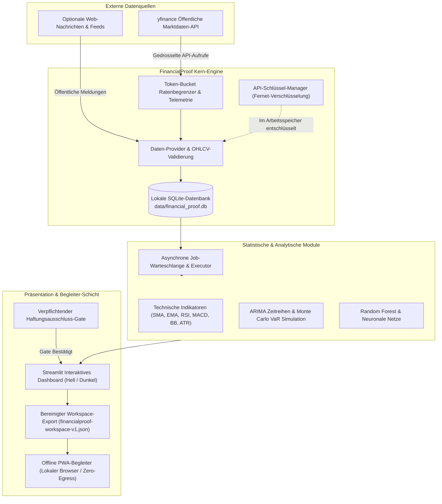
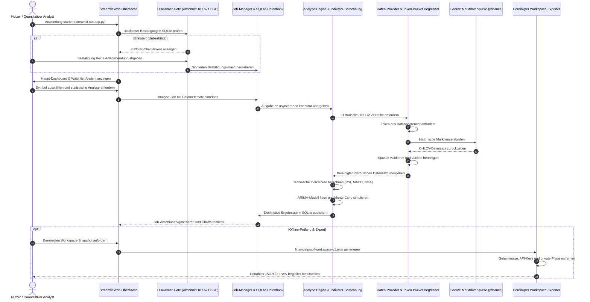

<!-- Alternatives Banner: assets/banner-b.png (gelegentlich tauschen) -->

# FinancialProof

[](LICENSE)
[](https://python.org)
[](https://streamlit.io)
[](#15-testing-verification)
[](#12-offline-pwa-companion)
[](THIRD_PARTY_LICENSES.md)
[](MARKETING-LOG.txt)
[](SECURITY.md)
[](SECURITY.md)
[](#17-security-privacy)
[](#3-architecture)
[](llms.txt)
[](https://github.com/assistassets-ai)
[](https://github.com/open-bricks)
[](#18-legal-disclaimer)

[English](README.md) | 🌐 **Deutsch**

> [!NOTE]
> **KI- / LLM-Integration & Maschinenlesbarer Kontext**
> Automatisierte KI-Agenten, LLM-Assistenten und Code-Crawler finden in [`llms.txt`](llms.txt) alle wesentlichen Projektstrukturen, Sicherheitsleitplanken, Suchbegriffe und Verifikationspfade.

> ⚠️ **Keine Anlageberatung / No Financial Advice**
>
> FinancialProof ist ein **technisches Software-Werkzeug** zur statistischen Musteranalyse und deskriptiven Indikator-Auswertung auf Finanzmarktdaten. Es ist:
> - **Keine Anlageberatung** (§ 32 KWG, § 2 Abs. 9 WpHG)
> - **Keine Handels- oder Anlageempfehlung**
> - **Kein Prognosesystem**
> - **Nicht BaFin-reguliert**, lizenziert oder registriert
>
> Alle berechneten Indikatoren beschreiben historische mathematische Eigenschaften. Investitionsentscheidungen verbleiben in der alleinigen Eigenverantwortung des Nutzers. Unentgeltliche Gefälligkeit; Haftung beschränkt auf Vorsatz und grobe Fahrlässigkeit (§ 521 BGB).

---

## 🧭 Schnellnavigation

[1. Übersicht](#1-overview) • [2. Funktionen](#2-key-features) • [3. Architektur](#3-architecture) • [4. Lebenszyklus](#4-lifecycle) • [5. Personas](#5-target-personas) • [6. Vergleich](#6-comparison-matrix) • [7. Invarianten](#7-governance-invariants) • [8. Abgrenzung](#8-search-disambiguation) • [9. Screenshots](#9-screenshots) • [10. Setup](#10-installation) • [11. Launcher](#11-windows-launcher) • [12. PWA](#12-offline-pwa-companion) • [13. Konfiguration](#13-configuration) • [14. Struktur](#14-project-structure) • [15. Tests](#15-testing-verification) • [16. SBOM](#16-third-party-licenses) • [17. Sicherheit](#17-security-privacy) • [18. Disclaimer](#18-legal-disclaimer)

---

<a id="1-overview"></a><a id="overview"></a>
## 1. Übersicht

**FinancialProof** ist eine lokale, offline-fähige Streamlit-Anwendung für die historische Finanzmarktdatenanalyse, mathematische Indikatorberechnung und statistische Mustererkennung. Im Gegensatz zu kommerziellen Broker-Plattformen und automatisierten Trading-Bots arbeitet FinancialProof zu 100 % auf Ihrem lokalen Rechner, speichert Zustände in einer lokalen SQLite-Datenbank und schützt Ihre Marktanalysen vor Tracking oder Datenabfluss in fremde Clouds.

Jedes Ergebnis, Diagramm und mathematische Modell wird ausdrücklich als deskriptive historische Auswertung bereitgestellt. FinancialProof ermöglicht es quantitativen Forschern, technischen Analysten, Studenten und datenschutzbewussten Anlegern, historische Kursverläufe zu untersuchen, statistische Hypothesen zu testen und Watchlists lokal zu pflegen, ohne vertrauliche Portfoliodaten an Drittanbieter übertragen zu müssen.

---

<a id="2-key-features"></a><a id="key-features"></a>
## 2. Kernfunktionen

- **Technische Indikatoren**: Historische Berechnung von SMA, EMA, RSI, Bollinger Bands, MACD, Stochastik-Oszillatoren und Average True Range (ATR).
- **Muster- & Anomalieerkennung**: Regelbasierte Erkennung historischer technischer Konfigurationen (Durchkreuzung gleitender Durchschnitte, RSI-Grenzwerte) — rein deskriptiv und nicht prognostizierend.
- **Statistische Modellierung & Simulation**:
  - **ARIMA-Zeitreihenmodelle**: Ökonometrische Parameterschätzung via `statsmodels` (diagnostischer Fit, keine Garantien).
  - **Monte-Carlo-Simulationen**: Historische Value-at-Risk (VaR) Modellierung und Pfadsimulationen.
  - **Mean-Reversion-Analyse**: Statistische Abweichungsanalyse, Z-Score-Berechnung und historische Halbwertszeiten.
  - **Überwachte ML-Klassifikation**: Historische Trendkategorisierung mittels Random Forest (`scikit-learn`) und neuronalen Netzen (`tensorflow`).
  - **Finanznachrichten-Sentiment**: Lokale NLP-Klassifikation von Schlagzeilen via `transformers`.
  - **Web-Research-Agent**: Headless-Recherchemodul für Marktberichte und Unternehmensmeldungen.
- **Asynchrone Aufgabenwarteschlange**: Hintergrundausführung rechenintensiver Analysen mit SQLite-Job-Persistenz und Statusüberwachung.
- **Konfigurierbare Strategie-Vorlagen**: Asset-Klassen-spezifische Parameter-Presets (Aktien, Forex, Rohstoffe, Krypto) mit Revisions-Audit-Logs.
- **Multi-Asset-Watchlist**: Lokales Tracking, benutzerdefinierte Notizen und schnelle Filterung.
- **Token-Bucket-Ratenbegrenzer**: Hardware-nahes Throttling und Live-Telemetrie für öffentliche Marktdaten-Schnittstellen (`yfinance`).
- **Offline PWA-Begleiter**: Eigenständige, abhängigkeitsfreie Browser-PWA (`web_companion/`) zur mobilen Einsicht exportierter Daten ohne Internetverbindung.

---

<a id="3-architecture"></a><a id="architecture"></a>
## 3. Architektur & Systemtopologie

Die Architektur trennt Datenabruf, analytische Verarbeitung, lokale Persistenz und Präsentation in klar entkoppelte Schichten, die ausschließlich im Benutzerkontext laufen:



---

<a id="4-lifecycle"></a><a id="lifecycle"></a>
## 4. Ausführungs-Lebenszyklus & Datenfluss



---

<a id="5-target-personas"></a><a id="target-personas"></a>
## 5. Zielgruppen & High-Intent SEO

FinancialProof wurde gezielt für vier Hauptzielgruppen mit klaren technischen Anforderungen konzipiert:

| Persona-ID & Profil | Primärer Einsatzzweck & Bedarf | Typische Suchanfragen (High-Intent) | FinancialProof Lösung |
|---|---|---|---|
| **`[PERSONA-01]` Quantitative Finanz-Studenten & Forscher** | Empirische Marktforschung, mathematische Formelprüfung, ARIMA-Modelle und Monte-Carlo-Simulationen. | `local-first financial analysis python`, `historical technical indicators streamlit`, `arima monte carlo stock pattern recognition` | Vollständig transparente, nachvollziehbare lokale Python-Berechnungen; offene mathematische Formeln; keine Black-Box-Metriken. |
| **`[PERSONA-02]` Algorithmische Händler & Technische Analysten (Offline / Self-Hosted)** | Systematische Mustererkennung, Indikator-Backtesting und Watchlist-Organisation ohne Cloud-Verbindung. | `self-hosted stock watchlist sqlite`, `yfinance rate limiter streamlit`, `technical indicator backtesting python local` | Token-Bucket Ratenbegrenzung öffentlicher Schnittstellen; konfigurierbare Strategie-Presets; asynchrone SQLite-Job-Queue. |
| **`[PERSONA-03]` Datenschutzbeauftragte & Compliance-Officer** | Strenge Datenisolation, Zero-Cloud-Egress, unprivilegierte Ausführung und rechtssichere Einordnung. | `no-brokerage stock tracker`, `offline-first market research tool`, `local data sovereignty finance dashboard` | 100 % lokale Datenspeicherung; Fernet-verschlüsselte Geheimnisse; unprivilegierte `RunAsInvoker`-Ausführung ohne Adminrechte. |
| **`[PERSONA-04]` Open-Source-Entwickler & KI-Agent-Ingenieure** | Automatisierungswerkzeuge, maschinenlesbare Finanzkontexte und modulare Indikator-Pipelines. | `financialproof assistassets-ai`, `streamlit financial dashboard open source`, `llms.txt finance dataset` | Strukturierte `llms.txt`-Spezifikation; modulare Analyse-Registry; lückenlose Vertrags- und Headless-Testabdeckung. |

---

<a id="6-comparison-matrix"></a><a id="comparison-matrix"></a>
## 6. Umfassende Vergleichsmatrix

Detaillierter Architekturvergleich gängiger Alternativen gemappt auf unsere 10 Governance- und Laufzeit-Invarianten:

| Invariante / Kriterium | FinancialProof | Kommerzielle Broker-SaaS (TradingView / Robinhood) | Proprietäre Trading-Bots (Gunbot / 3Commas) | Schwere Cloud-Terminals (Bloomberg / FactSet) | Generische Tabellen (Excel / Google Sheets) |
|---|---|---|---|---|---|
| **`INV-LOCAL-01` Local-First & Zero Egress** | ✅ **100 % Lokale SQLite** | ❌ Vollständige Cloud-Telemetrie | ❌ Cloud-Steuerungsebene | ❌ Gehostete Infrastruktur | ⚠️ Teilweise (Google Sheets Cloud) |
| **`INV-NOADV-02` Disclaimer-Schranke** | ✅ **4-Checkboxen (§ 521 BGB)** | ⚠️ In AGB versteckt | ❌ Kommerzielle Kaufempfehlungen | ⚠️ Standard-Hinweise | ❌ Keine Schutzschranke |
| **`INV-RUNAS-03` Unprivilegierte Ausführung** | ✅ **`RunAsInvoker` User Space** | ❌ Nur im Webbrowser | ⚠️ Oft Admin-Rechte nötig | ❌ Dedizierter Systemdienst | ✅ Benutzerkontext |
| **`INV-RATE-04` Token-Bucket Begrenzer** | ✅ **Konfigurierbare Drosselung**| ❌ Intransparente Quoten | ⚠️ Einfaches Polling | ❌ Teure Abfragekontingente | ❌ Unkontrollierte externe Aufrufe |
| **`INV-SQLITE-05` ACID-Persistenz** | ✅ **Transaktionale SQLite** | ❌ Proprietäre Cloud-DB | ⚠️ Key-Value-Store | ❌ Proprietäre Groß-DB | ❌ Flache Dateien / Zellenfehler |
| **`INV-EXPORT-06` Bereinigter Workspace-Export**| ✅ **Geheimnis-freies JSON** | ❌ Proprietäres Silo | ⚠️ Rohe Konfigurationsdaten | ⚠️ Streng regulierte Formate | ❌ Unbereinigte Tabellenkopie |
| **`INV-PWA-07` Offline PWA-Begleiter** | ✅ **Autarke Browser-PWA** | ❌ Erfordert Internet | ❌ Erfordert Cloud-Verbindung | ❌ Erfordert Online-Lizenz | ❌ Cloud-Abhängig (Google Sheets) |
| **`INV-SEC-08` Geheimnis-Verschlüsselung** | ✅ **Fernet Symmetrisch** | ❌ Auf Fremdservern | ⚠️ Klartext oder reversibel | ❌ Zentrales Cloud-Vault | ❌ Klartext in Formelzellen |
| **`INV-DOCS-09` Zweisprachige Parität** | ✅ **100 % 18-Punkte-Parität**| ⚠️ Nur teilweise Übersetzung | ❌ Nur Englisch | ⚠️ Reines Fach-Englisch | ❌ Fragmentiert |
| **`INV-SLA-10` 48h SLA & § 521 BGB** | ✅ **48h Reaktionsgarantie** | ⚠️ Generischer Support | ❌ Nur Community-Forum | ⚠️ Nur Enterprise-Kunden | ❌ Keine Reaktionszusage |

---

<a id="7-governance-invariants"></a><a id="governance-invariants"></a>
## 7. Governance- & Laufzeit-Invarianten

FinancialProof garantiert zehn zentrale Invarianten über Quellcode, Builds und Laufzeitumgebung hinweg:

| Invarianten-Code | Leitprinzip | Beschreibung & Technische Umsetzung | Verifikationsmethode |
|---|---|---|---|
| `INV-LOCAL-01` | **Local-First & Zero Egress** | Alle Analysen, Berechnungen und Datenbanken laufen lokal. Keine Telemetrie verlässt den Rechner. | `tests/test_database.py` & `SECURITY.md` |
| `INV-NOADV-02` | **Keine Anlageberatung** | Verpflichtendes 4-Checkboxen-Gate vor der Nutzung (§ 32 KWG, § 2 Abs. 9 WpHG). | `ui/disclaimer_widget.py` |
| `INV-RUNAS-03` | **Unprivilegierter Modus** | Anwendung und Launcher starten strikt im normalen Benutzerkontext (`RunAsInvoker`). | `build_exe.bat` & `SECURITY.md` |
| `INV-RATE-04` | **Token-Bucket Begrenzer** | Burst-Schutz und Live-Telemetrie verhindern API-Sperren bei öffentlichen Datenabrufen. | `core/rate_limiter.py` |
| `INV-SQLITE-05` | **SQLite-Persistenz** | ACID-konforme Speicherung aller Watchlists, Jobs und Presets in Standard-SQLite. | `core/database.py` |
| `INV-EXPORT-06` | **Bereinigter Export** | `financialproof-workspace-v1.json` entfernt automatisch alle sensiblen Schlüssel und Pfade. | `tests/test_workspace_export.py` |
| `INV-PWA-07` | **Offline PWA-Begleiter** | Mobilfähige Web-App funktioniert dank ServiceWorker völlig ohne Netzwerkverbindung. | `web_companion/tests/` |
| `INV-SEC-08` | **Geheimnis-Quarantäne** | Optionale API-Schlüssel werden mit symmetrischer Fernet-Verschlüsselung abgelegt; `.env` isoliert. | `config.py` & `tests/test_config.py` |
| `INV-DOCS-09` | **Zweisprachige Dokumentation**| Vollständige wechselseitige 18-Punkte-Ankerparität zwischen englischer und deutscher Version. | `tests/test_metadata.py` |
| `INV-SLA-10` | **48h Sicherheits-SLA** | Garantierte Erstreaktion auf gemeldete Schwachstellen innerhalb von 48 Stunden (§ 521 BGB). | `SECURITY.md` |

---

<a id="8-search-disambiguation"></a><a id="search-disambiguation"></a>
## 8. Abgrenzung & Suchbegriffe

FinancialProof versteht sich klar als **lokales Analysewerkzeug für historische Finanzmarktdaten**. Es unterscheidet sich bewusst von:

- **Trading-Bots & Brokern**: Keine automatischen Orders, keine Depotführung, keine Schnittstellen zu Brokern.
- **Anlageberatung & Signal-Diensten**: Keine Kaufs-/Verkaufsempfehlungen oder regulierten Finanzdienstleistungen.
- **Vermögensnachweis- & Kredit-Software**: Kein Bankauszug-Generator, kein Proof-of-Funds und kein Bonitäts-Scoring.
- **Cloud-Finanz-SaaS**: Keine serverseitige Speicherung von Watchlists; alle Daten bleiben auf Ihrer Festplatte.

### Relevante Suchbegriffe:
```
FinancialProof assistassets-ai
local-first Streamlit stock analysis no trading
historical technical indicators yfinance SQLite watchlist
financialproof workspace export PWA companion
local finance analysis no advice open source
Streamlit yfinance ARIMA Monte Carlo local dashboard
historical market pattern analysis Python
SQLite watchlist Streamlit no brokerage
offline-first market data analysis tool
```

---

<a id="9-screenshots"></a><a id="screenshots"></a>
## 9. Benutzeroberfläche & Screenshots

FinancialProof bietet eine reaktionsschnelle Streamlit-Oberfläche im hellen und dunklen Design mit interaktiven Plotly-Diagrammen:

### Helles Design (Light Theme)


### Dunkles Design (Dark Theme)


---

<a id="10-installation"></a><a id="installation"></a>
## 10. Installation & Schnelleinstieg

### Voraussetzungen
- **Python**: Version 3.11 oder höher
- **Paketmanager**: `pip` oder `uv`

### Installationsschritte

1. **Repository klonen**:
   ```bash
   git clone https://github.com/assistassets-ai/FinancialProof.git
   cd FinancialProof
   ```

2. **Virtuelle Umgebung anlegen und aktivieren**:
   ```bash
   # Linux / macOS
   python3 -m venv venv
   source venv/bin/activate

   # Windows
   python -m venv venv
   .\venv\Scripts\activate
   ```

3. **Abhängigkeiten installieren**:
   ```bash
   pip install -r requirements.txt
   ```

4. **Anwendung starten**:
   ```bash
   streamlit run app.py
   ```

5. **Dashboard aufrufen**:
   Öffnen Sie `http://localhost:8501` im Webbrowser. Beim ersten Start müssen Sie die 4 Checkboxen des Haftungsausschlusses bestätigen, um die Analysen freizuschalten.

---

<a id="11-windows-launcher"></a><a id="windows-launcher"></a>
## 11. Windows-Launcher EXE

Für Windows-Arbeitsplätze kann ein unprivilegierter Launcher lokal kompiliert werden:

```cmd
build_exe.bat
```

Das Skript erzeugt `FinancialProof.exe`. Die ausführbare Datei fungiert als schlanker Bootstrap-Loader und benötigt keinerlei Administratorrechte. Build-Artefakte (`build/`, `dist/`, `*.spec`, `*.exe`) werden durch `.gitignore` zuverlässig ignoriert.

---

<a id="12-offline-pwa-companion"></a><a id="offline-pwa-companion"></a>
## 12. Offline PWA-Begleiter

Im Ordner `web_companion/` befindet sich eine eigenständige Progressive Web App (PWA):
- **Vollständiger Offline-Betrieb**: Gesteuert durch eine ServiceWorker-Caching-Strategie (`sw.js`) ohne externe Serveraufrufe.
- **Sicherer Datenimport**: Liest die aus Streamlit exportierte Datei `financialproof-workspace-v1.json` ein.
- **Geprüfte Qualität**: 151 automatisierte Tests sichern XSS-Schutz (`escHtml`), Schemavalidierung und Sprachumschaltung ab.

Testausführung des Begleiters:
```bash
cd web_companion
npm test
```

---

<a id="13-configuration"></a><a id="configuration"></a>
## 13. Konfiguration & Umgebungsvariablen

Konfigurieren Sie optional eine `.env`-Datei auf Basis von `env.example`:

| Umgebungsvariable | Standardwert | Beschreibung |
|---|---|---|
| `FINANCIALPROOF_LOG_LEVEL` | `INFO` | Protokollierungsstufe (`DEBUG`, `INFO`, `WARNING`, `ERROR`). |
| `FINANCIALPROOF_RL_YF_CAPACITY` | `60.0` | Token-Bucket-Kapazität für yfinance-API-Aufrufe. |
| `FINANCIALPROOF_RL_YF_REFILL` | `1.0` | Auffüllrate (Token pro Sekunde) für Marktdatenabfragen. |
| `FINANCIALPROOF_STORAGE_KEY` | *(automatisch)* | Base64-Fernet-Schlüssel für verschlüsselte API-Schlüssel. |

---

<a id="14-project-structure"></a><a id="project-structure"></a>
## 14. Projektstruktur

```
FinancialProof/
├── app.py                       # Haupt-Streamlit-Einstiegspunkt
├── config.py                    # Konfigurations- und Schlüsselverwaltung
├── financialproof_launcher.py   # Windows-Launcher Bootstrap-Skript
├── pyproject.toml               # PEP 621 Metadaten und Pytest-Konfiguration
├── requirements.txt             # Gesperrte Abhängigkeiten
├── NOTICE                       # Urheberrechts- und Lizenznachweis
├── THIRD_PARTY_LICENSES.md      # Level 1 SBOM und Invarianten-Matrix
├── MARKETING-LOG.txt            # Pfad-B-Marketing- und Discoverability-Log
├── llms.txt                     # Maschinenlesbarer Kontext für KI-Agenten
├── analysis/                    # Statistische, ML- und Ökonometrie-Module
│   ├── arima.py                 # ARIMA-Zeitreihenschätzung
│   ├── monte_carlo.py           # Monte-Carlo Value-at-Risk Modellierung
│   ├── mean_reversion.py        # Z-Score und Mean-Reversion-Berechnung
│   └── ml_classifier.py         # Random Forest und neuronale Netze
├── core/                        # Infrastruktur- und Datenschicht
│   ├── data_provider.py         # yfinance Schnittstelle und Datenvalidierung
│   ├── database.py              # SQLite-Schema, Migrationen und CRUD
│   └── rate_limiter.py          # Token-Bucket Begrenzer mit Telemetrie
├── indicators/                  # Technische Indikatoren und Muster
│   ├── signals.py               # Deskriptiver Mustergenerator
│   └── technical.py             # SMA, EMA, RSI, MACD, Bollinger Bands, ATR
├── tests/                       # Test-Suite (218+ Tests)
│   ├── source_platform_smoke.py # Headless Cross-Plattform Smoketest (6/6)
│   ├── test_metadata.py         # Metadaten-, Invarianten- und Doku-Vertragstests
│   └── test_*.py                # Umfassende Unit- und Regressionstests
└── web_companion/               # Offline PWA-Begleiter (151 Tests)
```

---

<a id="15-testing-verification"></a><a id="testing-verification"></a>
## 15. Tests & Qualitätssicherung

FinancialProof unterliegt strengen Qualitätskontrollen über alle Komponenten hinweg:

1. **Python Unit- & Vertragstests**:
   ```bash
   pytest
   ```
   *Aktueller Status: 218+ bestanden (100 % grün).*

2. **Headless Cross-Plattform Smoketest**:
   ```bash
   python tests/source_platform_smoke.py
   ```
   *Aktueller Status: 6/6 Prüfungen erfolgreich.*

3. **Web-Companion Test-Suite**:
   ```bash
   cd web_companion
   npm test
   ```
   *Aktueller Status: 151 bestanden in 30 Suiten.*

4. **Mermaid-Syntaxprüfung**:
   ```bash
   python _tools/lint_mermaid.py .
   ```
   *Aktueller Status: 0 Syntaxprobleme.*

---

<a id="16-third-party-licenses"></a><a id="third-party-licenses"></a>
## 16. Drittanbieter-Lizenzen & Level 1 SBOM

- **Kern-Lizenz**: [MIT License](LICENSE).
- **Laufzeit-Abhängigkeiten**: Ausschließlich permissive Open-Source-Lizenzen (MIT, Apache-2.0, BSD-3-Clause, PSFL).
- **Kein Copyleft-Risiko**: Keine GPL-, AGPL- oder proprietären Binär-Komponenten gebündelt.
- **Detailliertes SBOM-Inventar**: Vollständige Übersicht aller Lizenzen und Invarianten-Zuordnungen in [`THIRD_PARTY_LICENSES.md`](THIRD_PARTY_LICENSES.md).

---

<a id="17-security-privacy"></a><a id="security-privacy"></a>
## 17. Sicherheit & Geheimnis-Quarantäne

FinancialProof gewährleistet vollständige Datensouveränität:
- **Lokale SQLite-Speicherung**: Datenbanken, Logs und Caches liegen im Ordner `data/` und sind per `.gitignore` geschützt.
- **Verschlüsseltes Schlüsseldepot**: Optionale API-Schlüssel werden per Fernet symmetrisch verschlüsselt gespeichert.
- **Unprivilegierte Ausführung**: Läuft ohne Administratorrechte (`RunAsInvoker`).
- **Sicherheitsrichtlinie**: Meldewege für Schwachstellen sind in [`SECURITY.md`](SECURITY.md) dokumentiert.

---

<a id="18-legal-disclaimer"></a><a id="legal-disclaimer"></a>
## 18. Rechtlicher Hinweis (§ 521 BGB) & 48h SLA

### Gesetzlicher Haftungsrahmen (§ 521 BGB Gefälligkeitsrecht)
FinancialProof wird unentgeltlich als Open-Source-Software bereitgestellt. Gemäß § 521 BGB haftet der Urheber bei unentgeltlicher Überlassung ausschließlich für Vorsatz und grobe Fahrlässigkeit. Die Software stellt keine Anlage-, Rechts-, Steuer- oder Finanzberatung dar (§ 32 KWG, § 2 Abs. 9 WpHG). Sämtliche Berechnungen sind deskriptive statistische Betrachtungen historischer Daten ohne Prognosecharakter.

### 48-Stunden-Sicherheits-SLA
Wir verpflichten uns zu einer Erstreaktion auf dokumentierte Sicherheitsmeldungen innerhalb von **48 Stunden**. Hinweise können über GitHub Security Advisories oder an die in [`SECURITY.md`](SECURITY.md) genannten Kontaktadressen gemeldet werden.
