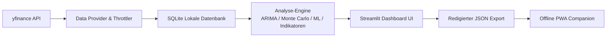
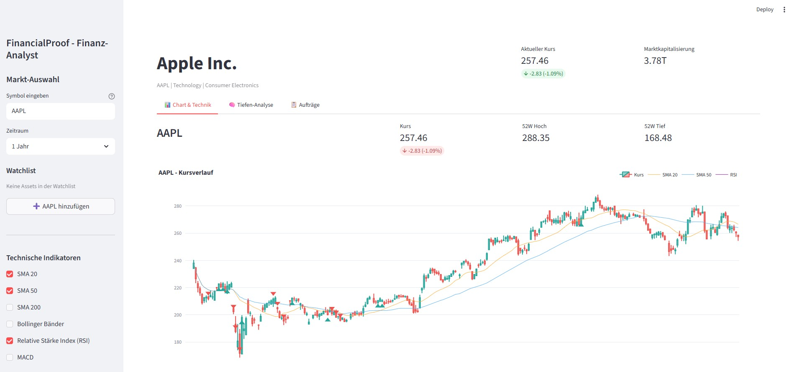
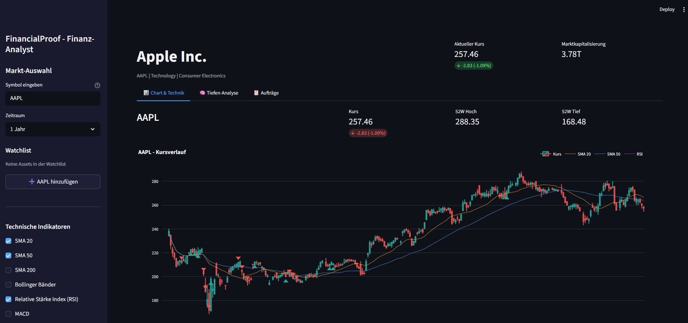

# FinancialProof

[](LICENSE)
[](https://python.org)
[](https://streamlit.io)
[](#schnelleinstieg)
[](#architektur)
[](#architektur)
[](llms.txt)
[](#hinweis-keine-anlageberatung)

[English](README.md) | **Deutsch**

> [!NOTE]
> **KI- / LLM-Integration & Maschinenlesbarer Kontext**
> Automatisierte KI-Agenten, LLM-Assistenten und Code-Analyse-Crawler finden in [`llms.txt`](llms.txt) strukturierten Kontext, Sicherheitsregeln, Suchanker und Einstiegspunkte zur Testverifikation.

> ⚠️ **Keine Anlageberatung / No Financial Advice**
>
> FinancialProof ist ein **technisches Werkzeug** zur statistischen
> Mustererkennung auf Finanzdaten. Es ist:
>
> - **Keine Anlageberatung** (§ 32 KWG, § 2 Abs. 9 WpHG)
> - **Keine Kauf-/Verkaufsempfehlung**
> - **Keine Prognose** künftiger Kursentwicklungen
> - **Nicht BaFin-zugelassen**, nicht reguliert
>
> Die angezeigten Indikatoren sind historische statistische Muster.
> Anlageentscheidungen bleiben eigenverantwortlich — konsultieren Sie
> qualifizierte Fachleute (Bank, Steuerberater, Anlageberater).
>
> Unentgeltliche Open-Source-Schenkung. Haftung auf Vorsatz und grobe
> Fahrlässigkeit beschränkt (§ 521 BGB). Nutzung auf eigenes Risiko.

Lokales Streamlit-Werkzeug zur statistischen Musteranalyse von Finanzmarktdaten.
FinancialProof läuft vollständig lokal auf Ihrem System, speichert den Laufzeitstatus
in einer lokalen SQLite-Datenbank und strukturiert jedes Ergebnis als historische,
deskriptive Analyse ohne Anlageberatung oder Handelsempfehlung.

Verwenden Sie FinancialProof, wenn Sie historische technische Indikatoren prüfen,
Analysemodule vergleichen, eine lokale Watchlist führen und technische Marktmuster
dokumentieren möchten — ohne ein Broker-Konto zu verbinden oder private Daten an einen
gehosteten Dienst zu senden.

## Schnelleinstieg

| Ziel | Datei / Ordner | Hinweis |
|------|----------------|---------|
| Lokale App starten | [`app.py`](app.py) | Start mit `streamlit run app.py`; beim Erststart ist die Disclaimer-Bestätigung erforderlich. |
| Datenformat verstehen | [`EXPORTFORMAT.md`](EXPORTFORMAT.md) | Beschreibt das redigierte `financialproof-workspace-v1.json` Exportformat. |
| Offline-Companion nutzen | [`web_companion/`](web_companion/) | Schreibgeschützter Browser-Companion für exportierte Watchlists und Snapshots. |
| Tests ausführen | [`TESTLOG.md`](TESTLOG.md) | Node-Tests via `cmd /c npm test` im Ordner `web_companion`. |
| Sicherheitsregeln | [`SECURITY.md`](SECURITY.md) | `.env`, `.secrets`, SQLite-Datenbanken, Logs und API-Keys bleiben lokal. |

## Architektur



## Funktionen

- **Technische Indikatoren**: SMA, EMA, RSI, Bollinger Bänder, MACD, Stochastik, ATR
- **Mustererkennung**: Regelbasierte Erkennung technischer Muster (z. B. MA-Crossovers, RSI-Extreme) — historisch, nicht prädiktiv
- **Statistische & Pattern-Analysen**:
  - ARIMA-Zeitreihenanalyse (historischer Fit)
  - Monte-Carlo-Simulation (historische Value-at-Risk-Schätzung)
  - Mean-Reversion-Analyse
  - Random-Forest-Trendklassifikation (historisch)
  - Neuronaler Netz-Musterabgleich (historisch)
  - Sentiment-Analyse (Nachrichten-Texte)
  - Web Research Agent
- **Job-Queue-System**: Asynchrone Analyseaufgaben mit SQLite-Persistenz
- **Analyse-Presets**: Asset-spezifische deskriptive Regel-Presets mit Auswertungs-Logs
- **Watchlist**: Portfolio-Übersicht für mehrere Vermögenswerte
- **Betriebslogging**: Rotierendes lokales Logfile für Laufzeit-Diagnose
- **API-Rate-Limiting**: Konfigurierbare Drosselung für yfinance-Aufrufe
- **Deutsche Benutzeroberfläche & PWA-Begleiter**

## Abgrenzung & Suchbegriffe

FinancialProof ist ein **lokales Streamlit-Dashboard für historische Marktmusteranalyse**.
Es grenzt sich ausdrücklich ab von:

- Brokerage-Bots, Auto-Trading-Systemen oder Signal-Selling-Diensten
- Portfolioberatung, Robo-Advisor-Diensten, Steuerberatung oder regulierten Finanzdienstleistungen
- Bankauszug-Generatoren, Proof-of-Funds-Werkzeugen oder Krediteinreichungs-Generatoren
- Gehosteten Finanz-SaaS-Dashboards, die Watchlists oder API-Keys auf fremde Server hochladen

Wichtige Suchphrasen:

- `FinancialProof assistassets-ai`
- `local-first Streamlit stock analysis no trading`
- `historical technical indicators yfinance SQLite watchlist`
- `financialproof workspace export PWA companion`
- `offline-first market data analysis tool`

## Screenshots

**Helles Design:**



**Dunkles Design:**



## Installation & Start

1. **Repository klonen**
   ```bash
   git clone https://github.com/assistassets-ai/FinancialProof.git
   cd FinancialProof
   ```

2. **Virtuelle Umgebung erstellen**
   ```bash
   python -m venv venv
   # Windows:
   venv\Scripts\activate
   # Linux/Mac:
   source venv/bin/activate
   ```

3. **Abhängigkeiten installieren**
   ```bash
   pip install -r requirements.txt
   ```

4. **App starten**
   ```bash
   streamlit run app.py
   ```

## Lizenz

Dieses Projekt ist unter der MIT-Lizenz veröffentlicht — siehe [`LICENSE`](LICENSE).
